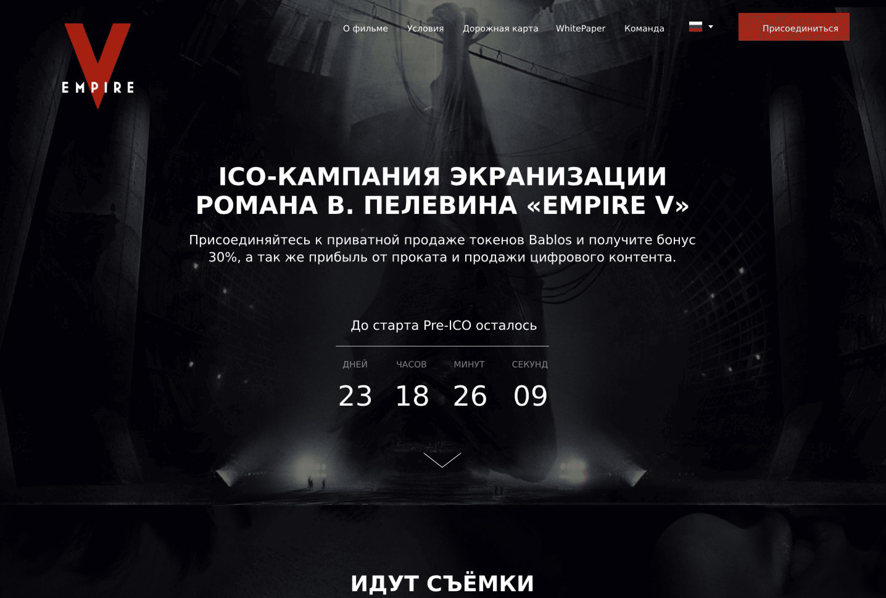

# Bablos

Простой лендинг-проект на Gulp, Sass и Pug.

- Один из моих первых проектов — март 2028 года.
- Ссылка на проект: https://bablos.com/

## О проекте

Этот проект собирает стили из `app/sass/style.scss` и шаблоны Pug из `app/pug/index.pug`, а затем запускает локальный сервер BrowserSync из папки `app`.

## Запуск

```bash
npm ci
npm start
```
